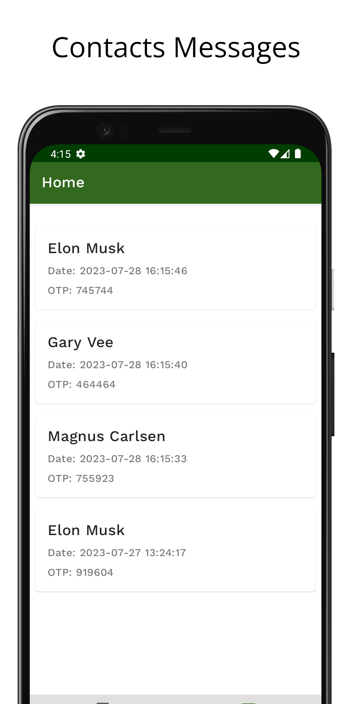

# Contacts SMS Android App

Contacts App allows to send OTP SMS to any contact using the Twilio REST API.

## App description

The app consists of two tabs in the Home screen. Contacts tab showing a list of contacts and Messages tab showing the list of details of messages sent.

 
Fig - contacts list.

 
 

On selecting a contact, the contact info page is shown. This page contains the contact's full name, phone number and “send message” button.

 
Fig - contacts info page

 
 

On clicking “send message”, the “Compose Message” screen is shown. This page contains the sms otp message containing a randomly generated 6 digit number 
about to be sent and a “send otp” button. On clicking the “send otp” button an sms is sent to the contact.

 
Compose Message screen

  

    
 
Message tab

## Libraries Used

1. The app uses a single activity and multiple fragments. 
1. Navigation component is used and there are 3 fragments to represent home screen, contact info screen and compose message screen.
1. Recyclerview is used to display the list of contacts and messages. DiffUtil is used to efficiently handle the changes in the list items.
1. Room Database is used to store the contacts data and the messages data. Initially the contacts data is loaded from a local json file.
1. Retrofit library is used to make the http request to Twilio service to send sms.
1. Viewmodel - logic is separated from the ui, and placed in the viewmodel. The changes to the data are observed using livedata.

## Testing the app functionality
  
Since the free version of Twilio service is used, sms can only be sent to mobile numbers verified in the twilio account. 
The verification needs authentication via an otp.

### Steps to test app functionality by using a different number - 
1. Create a free account in twilio
1. Copy the accountSID, authToken and generated twilio phone number from the dashboard to AccountSID, AuthToken, TwilioPhoneNum string values in the strings.xml file 

3. Verify a phone number in the twilio account. This involves otp verification.
3. Create a new contact inside the assets/defaultContacts.json file with the verified phone number.

5. Now run the app (uninstall and reinstall if you want to load the new data from json, this is because loading from json is currently done when the database is first created ), select the contact and press the send otp button to send the sms.
